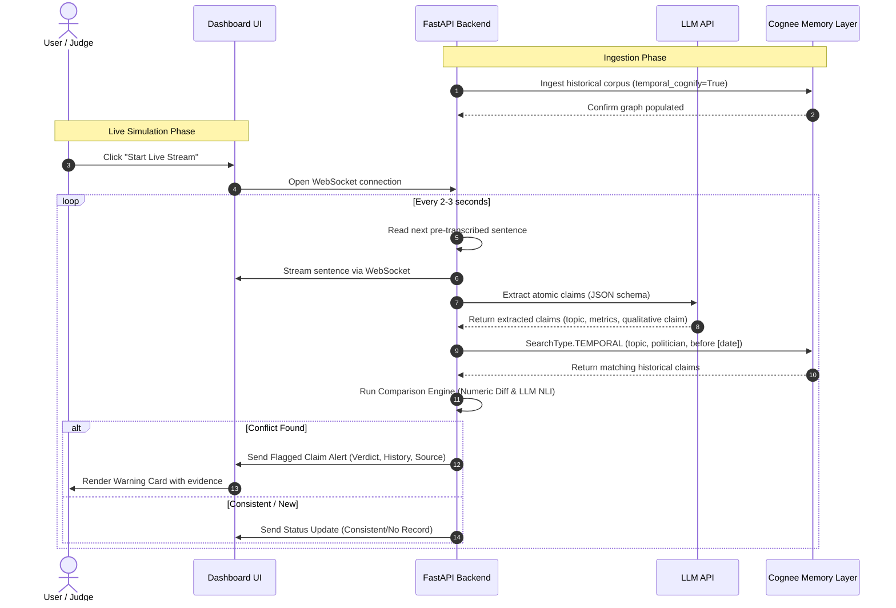

# Product Requirements Document (PRD) - Claim Consistency Tracker

## 1. Executive Summary & Vision
The **Claim Consistency Tracker** is a tool built for journalists, fact-checkers, and citizens to hold public figures accountable to their own record. Rather than building a generic "lie detector" (which suffers from subjective definitions of truth and intent), this system focuses strictly on **self-consistency**. 

By extracting atomic claims from a streaming or recent speech, the system queries a temporal knowledge graph of the speaker's historical statements to detect contradictions, policy shifts, and numeric drift. The system provides clear side-by-side evidence with dates and original source links.

---

## 2. Existing Architectural Decisions
As the repository is currently empty, our baseline architectural decisions establish the following:
*   **Python Stack:** A backend built on Python, utilizing FastAPI to handle the dashboard and simulated WebSocket stream.
*   **Cognee Memory Layer:** Serving as the temporal knowledge graph backend using `temporal_cognify` to structure historical claims.
*   **Hybrid Comparison Engine:** Splitting evaluation into a deterministic mathematical path for numeric figures (percentages, counts, dates) and an LLM-based NLI classifier for qualitative claims.
*   **Simulated Stream:** Streaming pre-transcribed text sentence-by-sentence via WebSockets to replicate a live speech without audio processing latency.

---

## 3. Assumptions Log
*   **[ASM-001]:** Cognee's local SQLite/Vector storage is sufficient for indexing and searching our mock dataset (50-150 historical statements) without requiring external Neo4j or Qdrant server instances.
*   **[ASM-002]:** Speeches used for the live demo are pre-transcribed and split at sentence boundaries to bypass speech-to-text processing noise.
*   **[ASM-003]:** Each statement in the historical corpus is associated with a specific date and verifiable source link.

---

## 4. Open Questions Log
*   **[QST-001]:** Should the frontend include an interactive network graph visualization showing Cognee's nodes, or is a card-based feed showing the transcript and flagged contradictions sufficient for the demo?
*   **[QST-002]:** How should the system handle "nuanced shifts" that do not directly contradict but indicate a subtle policy change? Should we define a fourth output label like `Nuanced change`?

---

## 5. User Personas & Core Workflows

### Personas
1.  **The Fact-Checker / Journalist:** Needs to monitor a politician's live press conference. Wants real-time alerts whenever a stated statistic or position diverges from the official archive.
2.  **The Hackathon Judge:** Evaluates the technical execution. Wants to verify that Cognee's temporal graph is actively queried (not bypassed) and that the comparison logic handles edge cases robustly.

### Core Workflow
1.  **Ingestion:** The system loads the historical statement corpus and pushes it to Cognee using Pydantic models. Cognee indexes the facts and timelines.
2.  **Simulation:** The user starts the live feed on the dashboard. The backend streams sentences over WebSockets.
3.  **Analysis:** For each sentence:
    *   Extract atomic claims.
    *   Query Cognee using `SearchType.TEMPORAL` for related claims made before the speech date.
    *   Compare the new claim with retrieved prior claims.
4.  **Reporting:** If a discrepancy is found, the system pushes a warning card to the UI containing the new claim, the historical claim, the calculated difference (if numeric), the source link, and the date.

---

## 6. System Architecture & Diagram

The flow of data from ingestion through live simulation and reporting is outlined in the diagram below:

---

## 7. Functional Requirements
*   **[REQ-001]:** The system must support loading a seed corpus of 50–150 historical statements from a CSV or JSON file, parsing them into structured DataPoints, and ingesting them into Cognee.
*   **[REQ-002]:** The system must expose a WebSocket endpoint that streams a pre-transcribed text file sentence-by-sentence at a configurable interval (default: 2.5 seconds).
*   **[REQ-003]:** The system must use an LLM with structured JSON output to extract atomic claims, identifying the topic (e.g., taxes, employment), the subject, the metric (if any), the numeric value (if any), and the core statement.
*   **[REQ-004]:** The system must perform temporal searches against Cognee to fetch claims by the same politician on the same topic that pre-date the current speech.
*   **[REQ-005]:** The comparison engine must mathematically compute differences for numeric claims (e.g., inflation rate changed from 3.2% to 4.5% is a +1.3% absolute drift) and assign the label `Stated figure differs from earlier figure by X%`.
*   **[REQ-006]:** The comparison engine must run qualitative statements through an LLM NLI step to evaluate contradictions, mapping the outcome to defined labels: `Consistent with prior statements`, `Contradicts statement from [date]`, or `No prior record`.

---

## 8. Non-Functional Requirements
*   **Performance Budget:**
    *   **Latency:** The backend must complete claim extraction, retrieval, and comparison within **2.0 seconds** per sentence to prevent backlogs in the live stream.
    *   **Memory:** The local backend memory consumption must remain below **500 MB** during operation.
*   **Security & Threat Model:**
    *   **Input Validation:** The backend must sanitize all incoming messages from the WebSocket.
    *   **Credential Isolation:** API keys for the LLM must be stored in a `.env` file and excluded from version control.

---

## 9. Migration & Retrofit Strategy
*   **Schema Evolution:** Because the project is an MVP, schema migrations will be handled by teardown and rebuild. We will provide a `reset_db.py` script that deletes the local graph/vector databases (sqlite/vector files under the Cognee storage directory) to allow clean schemas to be re-applied.

---

## 10. Risk Register
*   **[RSK-001]:** Cognee configuration or query errors block the pipeline.
    *   *Impact:* High.
    *   *Mitigation:* Create a minimal ingestion and retrieval script (`hello_cognee.py`) on Day 1 to verify graph traversals and schema registration before writing backend APIs.
*   **[RSK-002]:** Ambiguous claims cause false-positive contradictions in the NLI step.
    *   *Impact:* Medium.
    *   *Mitigation:* Frame the UI warnings as "consistency checks" and link to the source material to allow manual verification, rather than labeling them as absolute falsehoods. Pre-run and cache demo examples to guarantee smooth live execution.

---

## 11. Technology Stack & Verified Library Licenses
All libraries used are open-source and comply with commercial/hackathon use rules (Apache 2.0, MIT, or BSD). No copyleft or restricted licenses are included.

*   **Graph & Vector Database:** `cognee` (Apache 2.0) `[Verified]`
*   **Data Models & Validation:** `pydantic` (MIT) `[Verified]`
*   **Web Framework:** `fastapi` (MIT) `[Verified]`
*   **Web Server:** `uvicorn` (BSD-3-Clause) `[Verified]`
*   **API Client & Requests:** `httpx` (BSD-3-Clause) `[Verified]`
*   **Frontend UI:** Vanilla HTML, CSS, JavaScript (No license restrictions)
